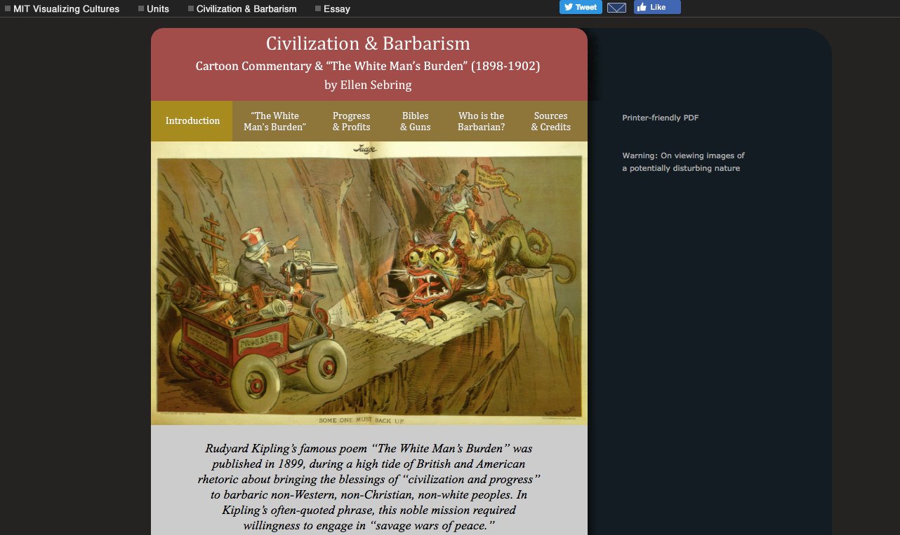

# Project Proposal

## Introduction

China at the Turn of the Century, is a digital collection of two archives. This collection strive to digitize China’s magazines and newspaper during the twentieth century. These two archives are: Shen Bao, 1872-1949, and Da Cheng Database of Old Journals. Shen Bao was the first modern China news print that was circulated from 1872 to 1949. According to Dachen Journal official website, Dachen was founded in 1949 and has more than 130,000 articles. University of Toronto grants access to the two archives for University of Toronto students and professors. These archives is categorized by the publish dates. Scholars can also search the title of an article or keywords. Articles are transcribed into Chinese so that scholars can easily search important keywords that would match the article. However, these database have so much potential to be utilize as a primary source for scholars who cannot read Chinese. China at the Turn of the Century, urges to translate the transcribed data of these archives so English scholars can utilize these resources. Additionally, the transcription of the two database only transcribed literature text such as police records or general discussion. However, commercial advertisements are all ignored in the transcription. This project is not only to translate the already transcribed information but it is also to transcribe commercial advertisements. Investigating commercial advertisements in the twentieth century can help scholars to understand the spending ability and habit, and the social norm. In addition, students will categorize these advertisements by content (will explain in the next section). Categorizing these advertisements by content then separate them into different section such as: food advertisements, car advertisements, and publication date. All of these information would be compiled onto a website. This use of digital media can help history scholars to research and analysis content by different category.

Throughout the twentieth century, China underwent a drastic changes, from the ending of the last dynasty to to rise of communism. Thus, it is important to keep existing information about the twentieth century. Furthermore, It is hard to achieve and obtain information from Chinese scholars because of the strict censorship. For instance, Cambridge University Press and Cambridge University both are well-known publication for Chinese history. However, recently in 2017, China had ordered Cambridge University to erase over 300 articles and book reviews from China Quarterly.[^1] China’s strict censorship is not only prevalent within their own country but also in foreign institutions as well. Evidently, it is crucial to digitize existing twentieth century documents before scholars get denied to access to these archives. As noted in Gerben Zaagsma’s “On Digital History” and Daniel Cohen and Roy Rosenzweigh’s “Becoming Digital”, in contemporary days, the digital age, enabled the expansion and development in digital humanities and the discipline of Digital History.[^2] Overall, this project is to stimulate undergraduate students to view history in a different perspective. This project provides an opportunity for students to further understand Digital History and be able to practically utilize digital history as a part of History scholarship. This website will be open to the public, where students can be utilize as a primary source for their research. The website will be first posted on the University of Toronto as an English database that transcribed Shenbao and Old Journals.

## Methods

The project would require 14 undergraduate students, preferably studying History as their major or specialist, 2 graduate students, 2 professors or Phd students, and 2 Computer Science students. The twelve undergraduate students will be divided into different teams: one group five students will be translating the transcribed texts in the archives into English; one group of five students are responsible to transfer advertisements content from the original pdf into English text; one group of two students are responsible for separating these content into different categories; one group of two students are responsible for proofreading or conduct research when needed. These undergraduate students will be required to transcribe texts throughout the full school year. These team of 12 undergraduate students should have background in History and can read Chinese. For students who cannot read or write Chinese, they can be assigned to categorize content. The project will also require assistance from two graduate students for guidance and editing to ensure accuracy. Two professors will be needed to generate meetings, trainings and guidance. The two Computer Science students will only be needed to create a website and input collected information onto the website. Professors would require to distribute applications to hire students who are interested to participate in this project. Professors would need to conduct training to explain the purpose of this project and teach students about Digital History at the same time. Professors should hire students who are major or specialist in History so this way will help students to change their perspective on view the discipline of history.

The three Computer Science students would need to use HTML to create the website, utilize Markup to write the texts, and CSS for style. Javascript is needed to give functionality and interactiveness for the website. These students should be familiar with all of these languages, and more important, they need to have a good understanding of the full stack. It would be great if students are familiar with of Javascript packages available such as popcorn js. Good knowledge of API from services such as Google Maps and how databases work and how to store information into the database, if we need to create user account. These skills might not be needed but it would be great if they acquired these skills to give more flexibility to create the website.

Students would require to login onto [library database](https://guides.library.utoronto.ca/chinaresources/ChineseNewspapers) of the University of Toronto. University of Toronto students will have the access to these archives. Students would need to create a slack account to better communicate with professors and graduate students. They would also need google accounts or evernote. Different groups can compile their works into a google documents or evernote; in this way students would not overlap others work. Students can divide the works among themselves and record their own work onto the google document. Proofreaders can then double check the work before sending it to the graduate students. The project is heavy rely on the collaboration between students.

## Timeline

This project will require one full school year to complete. The first step is offering this as an academically supportive opportunity for the PhD students or professors to have as a project that can become a pillar in their understanding of their respective subjects. Whether it is through managing information or accessing the material firsthand, upon completion of this project, this would be an insightful experience for them to complete their studies. Setting it up on their job board or having it integrated as part of their curriculum while offering an honorarium would be encourage students to take it on as a side project, similar to how being an assistant teacher can be productive towards their degree. This process has to be done before the end of the previous school year.

The hiring application for graduate students and undergraduate students would be send out once the position of PhD students or professors is confirmed (preferably before Summer semester ends). The first meeting should be conducted by mid-September. This would require PhD students or professors to conduct the first meetings and the assign works for different groups. Before assigning works to students, it would require PhD students or professors some time to be familiar with the database ( for PhD students or professors who studies East Asian Studies or Chinese history should be familiar with these two database already). After dividing students into groups they would start their own independent work and compile their work onto a google document or evernotes. In order to prevent overlaps, students would need to communicate with their group members on which assigned articles they want to complete via Slack. For the proofreading group, the two students would not require as much work in the beginning of the project. The research group need have bi-weekly meetings to discuss their progress and findings with one PhD student or professor. This meeting would require around one hour bi-weekly. Research students would need set and complete certain amount of work. Research students need to complete a bi-weekly report and send to report to PhD students or professors to update their progress. By the end of the first semester, the research group should complete 70% of project.

The proofreading group should start their assignment once the research group submit their compiled work. By the beginning of December, the proofreading group should compile all of their work and send it to graduate students for proofread. Then, the graduate students should send their finalized work to the computer science group students by January.

The categorization group should start their assignment in the second semester. They need to categorize the compiled information from the research group and separate into different section of the website. They need to communicate with PhD students or professors and the computer science group to better understand the structure of the website. They do not need to attend to bi-weekly meetings in the first semester but they can also help the research group to transcribe or translate the texts if they desired.

For the computer coding group, the two students would need to start format and formulate the website. Computer science students would need to communicate with PhD students or professors on how the website should be formulated. Once they finish the general format of the website, they can have a rest period until the research group compiled all their work together. This should be finished by mid-October. This can help the categorization group to understand the structure of the website.

## Importance

One of the reason why I want to propose for this project is that I utilize MIT university’s digital history project as my primary source. The [MIT visualize culture website](https://ocw.mit.edu/ans7870/21f/21f.027/civilization_and_barbarism/cb_essay01.html) is an interactive website that digitized primary source, specifically propaganda piece and cartoon of China during the end of the nineteenth century. The website is embedded with cartoon images along with analysis. As you can see in the description under About Visualizing Cultures, it was founded in 2002 by two MIT professors who wanted to implement digital history for research purposes. All of the images were taken from MIT's database and along with the images there are analysis written by both professors and students. However, the category of different section is a little bit messy.

Therefore, I want to propose University of Toronto to imitate MIT’s project. History, like literature, must be constantly reviewed and updated to the current standards and requirements of new technology and their audience to be codified permanently for future record. In the current informational and rising digital era, for history to be maintained and continuously available and accessible, it is essential to move these records into technology. Although history is known to be of the past, for it to exist and be made known for the future, it is essential to also adapt to this movement towards digitalization. In other words, this adaptation is the modernization of the Chinese history and record of their advertisement disciplines. Although it seems that the world is racing forward, this historical practice must be newly imbued into newer practices, so that the lessons learned from founding civilization is not lost. Additionally, by this project towards digital history, the categorization of past records and advertisements can be reviewed and categorized. As the information is transcribed, there is a collaborative effort that can look at it all from different lens to improve the organization of mass data. History might seem to be the past, but the present digitalization can be a new cornerstone for history as well. With digitized history, not only will this make permanence possible, but with its ease of access for greater audience comes the bridge of continuing this historical conversation for the future generations: the students.

As such, this digital research project is crucial in continuing the historical conversation for students and academic personnel, as it continuously expands and develops the scope of the intended readers of the content to be translated and transcribed. As of now, the current transcriptions of past history and their advertisements are accessible and legible only to those who can read Chinese. This greatly limits the target audience, readership and feasibility of increasing interest in Chinese history and values that are embedded into records of history and the advertisements. Additionally, with the censorship in China, there continues to be a looming threat on the horizon that may actually erase these records and advertisements. As such, this research project extends an invitation and incites the potential interest of students who cannot read Chinese, while also compiling, codifying and categorizing the information while it still exists. The disciplines of East Asian Studies and Chinese History welcome non-Chinese readers, and this is the inflection point to enable them to also utilize these sources as a primary source and rid them of their obstacles in heightening their learning. With the implementation of this project, students will have greater access, while the digitalization of these imprints of a civilization and group will make it much easier to share the foundations of the nation. The future of this project will give greater insight on how digitized information can actually aid and abet more efficient and comprehensive research. This permanent record will enduringly aid future students without the fear of losing the information over the ages as transcriptions that get lost.

In the face of improving students’ ability to absorb and utilize more knowledge, and making this available, this is a key step in moving beyond just sharing the records into a common language and having an alternative source. With the digitization project, the collaborative effort requires the combination of integrating interdisciplinary approaches and gives students outside of history and digital history a different perspective on the content and academic nature of the studies itself. In essence, the honorarium as an incentive to enlarge and augment their scope of studies, it broadens multiple students’ worldviews and gives them perspective into another country’s history and the scholarly value embedded within its records. Beyond integrating this concept of digital history as a legitimate field, the execution of this project alone will affect at least fourteen undergraduate students, two graduate students, two professors or PhD students and two computer science students. With this interdisciplinary collaboration, not only does this increase this group’s studies, but it creates opportunity to realistically illustrate how each separate degree and level of degree can learn mutually from working together. In the end, this will integrate the importance and interest of history with other areas of study through a multi-step process aimed towards a common goal.

## Budget

|   |  |  |  |  |  |  |
|  ------ | ------ | ------ | ------ | ------ | ------ | ------ |
|   | **Number of individuals** | **Honrarium for two semesters of work** | **fund avilable for equipment (printing, creating website)** | **Food expense for meeting and training** | **fund for database subscription or unforeseen fund** | **total** |
|  Undergraduate Students | 14 | 615 |  |  |  | 8610 |
|  Graduate Students | 2 | 650.5 |  |  |  | 1301 |
|  Professor/PhD supervisors | 2 | 800 |  |  |  | 1600 |
|  Equipment expenses |  |  | 500 |  |  | 500 |
|  Food expense |  |  |  | 350 |  | 350 |
|  Computer Sicence Student | 3 | 563 |  |  |  | 1689 |
|  Others |  |  |  |  | 950 | 950 |
|   |  |  |  |  |  |  |
|   |  |  |  | Grand Total |  | 15000 |

##

I will be using $15,000 for this project. I will use the majority of the fund for an honorarium for the work of the students and professors. $8610 will be distributed among 14 students. $ 1301 will be distributed among the two master/ graduate students. $1600 will be distributed among the two PhD or professors. This will come to the total of $11511. Since this only require the access to database only a minor amount of the fund will be used for others. $500 dollars is for equipment such as printing, subscribe to different language program, or subscription to online platform. $560 will be distributed among the two computer science students. The two computer science students receive less fund compare to the research students because the computer science students spends less time on the project. $350 would be used for supplying food for students during meetings. $950 dollars is set aside for buffer.

[^1]: Gao, Charlotte. "Cambridge University Press: To Bend The Knee or To Die in China?" The Diplomat. August 24, 2017. Accessed April 09, 2018. https://thediplomat.com/2017/08/cambridge-university-press-to-bend-the-knee-or-to-die-in-china/.
[^2]: Cohen, Daniel J, and Roy Rosenzweig. “Becoming Digital.” In Digital History: A Guide to Gathering, Preserving, and Presenting the Past on the Web. Philadelphia: University of Pennsylvania Press, 2006. http://chnm.gmu.edu/digitalhistory/digitizing/ and Zaagsma, G., (2013). On Digital History. BMGN - Low Countries Historical Review. 128(4), pp.3–29. DOI: http://doi.org/10.18352/bmgn-lchr.9344